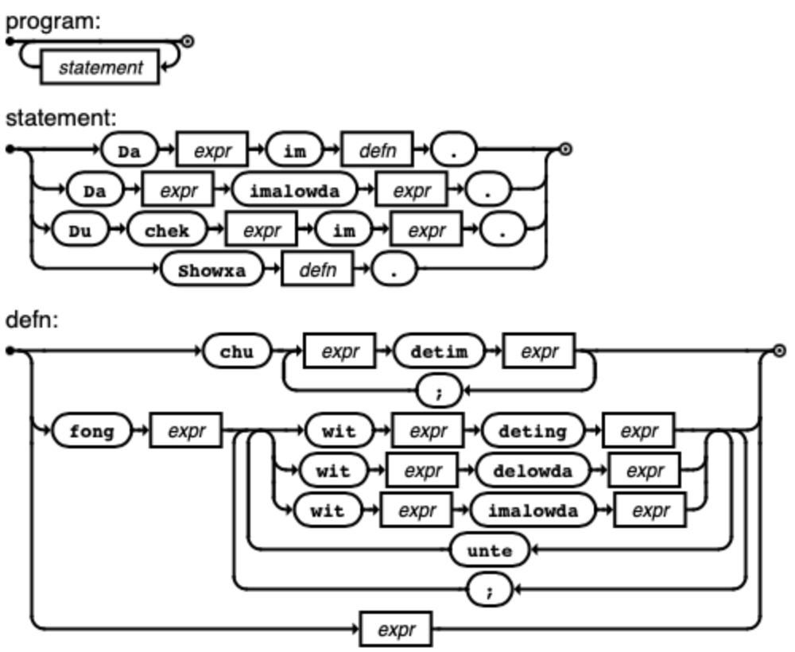

# BELTABOL

## Lexical structure

In principle, sequences of punctuation form operators, and alphanumerics literals and identifiers. Parens, square brackets, and string quotations group as usual; curly brackets are expected to become significant whenever unordered collections are added to the language.

Comments are `//` to end-of-line. (Limitation: currently '#!' at the beginning of a line is also treated as a comment wherever it occurs in an input file. This will probably stop being true whenever "BELTABOL WIT WOWT" (literate Beltabol) is implemented...)

To use an operator as an identifier, enclose it in parens, eg `(+)`. To use an identifier as an operator, enclose it in backticks, eg `` `mod` ``.

Cf [the source](../src/lexer.py) for full details.

## Grammar



### Statements

There are four statements:
```
    statement : DA expr IM defn DOT       $$ DaIm 1 3
    statement : DA expr IMALOWDA expr DOT $$ DaImalowda 1 3
    statement : DU CHEK expr IM expr DOT  $$ Chek 2 4 1 5
    statement : SHOWXA defn DOT           $$ Showxa 1
```

1. `Da ... im ...` binds definitions (at the top level)
2. `Da ... imalowda ...` creates algebraic datatypes
3. `Du chek ... im ...` is an equality test (run with `--test` option)
4. `Showxa ...` is used for print debugging

(Beltabol currently has no IO; if streams are ever implemented, then probably `Mesach ...` will provide bytestream output)

#### Examples

```
Da four im 2+2.
Da peano imalowda Zero | Succ(n).
Du chek four im 4.
Showxa Succ(Succ(Zero)).
```

### Compound Expressions

There are two compound expressions:
```
    defn : CHU {cdecl SEMIC} cdecl
    defn : FONG expr {rdecls SEMIC} rdecls
```

1. `Chu` is like Lisp's COND; each `cdecl` is of the form `expr DETIM guard` and evaluates the expression whose guard is the first to evaluate to 1. (the match operator, `?=`, may be used to extend the expression's environment)

2. `Fong` is like Lisp's LET (or an "identity monad"), and the expression is evaulated in the environment of the following local definitions. (of the form `WIT expr DETING expr`, corresponding to `DA ... IM ...` at the top level, or of the form `WIT expr IMALOWDA expr`, corresponding to `DA ... IMALOWDA ...` at the top level) Each definition is in scope for itself and the definitions before it; to obtain mutually recursive definitions group them with `unte`.

3. Note that unlike at the statement level, compound expressions must be parenthesized when they are embedded within other expressions.

#### Examples

```
Da fak(n) im chu
    n*fak(n-1) detim 1<=n;
    1          detim owta.

Du chek (fong cclvi*cclvi
  wit cclvi deting xvi*xvi;
  wit xvi   deting iv*iv;
  wit iv    deting ii*ii;
  wit ii    deting 2)
im 65536.

Showxa fong even(5)
  wit even(n) deting (chu 1        detim n==0;
                          odd(n-1) detim owta)
  unte
  wit odd(n) deting (chu 0         detim n==0;
                         even(n-1) detim owta).

Da sort(x) im fong (chu
    merge(sort(h),sort(t)) detim x?=h:=:t;
    x                      detim owta)
  wit merge(xs,ys) deting (chu (chu
        y<:merge(xs,y1) detim y<=x;
        x<:merge(x1,ys) detim owta
    ) detim xs?=x<:x1 && ys?=y<:y1;
    xs:=:ys detim owta).
```

### Simple Expressions

All operators are binary (with a pragmatic exception for unary negation).

In rough order of decreasing binding power, the precedence is as follows:
```
@ * / + - ++ `user_defined` :=: :> <: < <= == > ?= , | $ &&
```

Application is denoted either implicity, by `f(x)`, or explicity, by `f $ x`.

Cf [the parser](../src/parser.py) for full details.

#### Examples

```
reduce((:=:)) $ map(chr) $ map(ord) $ "foobar"
"("++sh(a)++x++sh(b)++")"
(hs:=:hs):=:rep(p,s)
```

## Semantics

The three built in datatypes are:
1. Numbers: integral, so division `/` may or may not behave as you expect.
2. Strings: byte-based strings.
3. Lists: lists of any beltabol value, including other Lists.

All are totally ordered within themselves, but incomparable between types.

All are also ordered sequences (Numbers are sequences of bits), and can be indexed with index `@` or cons'ed onto with cons `<:`. Strings and Lists are finite sequences, and hence can be concatenated with splice `:=:` or snoc'ed onto with snoc `:>`. Use these same operations with the match operator `?=` to deconstruct values instead of constructing them. (There is also a concat `++` operator, which attempts a Perl'ish DWIM approach to constructing and deconstructing values) Note that splice when used as a pattern match `h:=:t` attempts to assign `h` to a prefix and `t` to a suffix such that they are roughly the same length, which can come in handy for divide-and-conquer algorithms. 

In addition, algebraic datatypes (with constructors of fixed arity) are user-creatable, and also have a total order. They are not sequences, however, so can only be constructed (or pattern matched to deconstruct) via their constructors.

Closures are also values, but the only operations allowed with them are application `$` and composition `,`.

Limitation: in principle, the integers are supposed to be arbitrary-precision (hence why one can cons `<:` bits onto them but not splice `:=:` or snoc `:>`), but the current implementation uses rpython's limited width ints.

Limitation: there is no escaping convention currently for string literals, but `chr` and `ord` have been provided so in general arbitrary string values may be created.

Limitation: neither `>=` nor `<>` have yet made it to the front end.

Future work: unordered datatypes, indexing by values other than numbers, disjunction `|` of closures.

### Examples

```
Du chek 1<:2 im 5.
Du chek "f"<:"oobar" im "foobar".
Du chek 0<:1<:[2,3] im [0,1,2,3].
Du chek [0,1]:=:[2,3] im [0,1,2,3].
... dubik(a++a@s,Ptr(s+1,n-1)++t) detim c?=Ptr(s,n)++t; ...
... duimgut(Not(c,ef(a),y,b))  detim t?=Not(c,a,y,b) && x < y; ...
... len(h)+len(t) detim s?=h:=:t; ...
```

See also the `tst` subdirectory,
